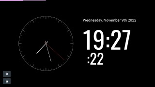
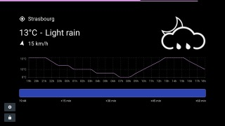
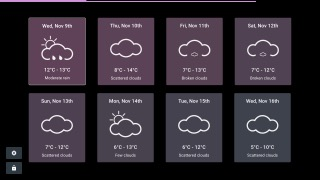

# Always-on personal station (AoPS)

If you don't know what to do with the tablet your grandmother gave you 10 years ago, then this is the project you need.

This app features full-page modules, which you can add and sort freely. See the "available modules" section for the full list. 

The app jumps automatically between modules and shows progressBars. The time spent on each module can be edited.

## Available modules

 - Analog clock & digital time with seconds
 - Live weather (using OpenWeatherMap API)
	 -  Weather
	 - Temperature
	 - Wind
	 - Location
	 - Next hour precipitation
	 - Severe wind and temperatures badges
 - Next days weather forecast

## Screenshots

## Compatibility

This app works on all modern browsers, and on Internet Explorer 11. Yes, you can give a new life to your Microsoft Surface RT (which is why I made the app originally 😄)

## Roadmap

 - [ ] Insert screenshots in Readme
 - [ ] Create a favicon
 - [ ] Insert a location selector to avoid filling the coordinates (Weather)
 - [ ] More than one module instance (manage Refs automatically)
 - [ ] Create an onboarding process, showing tips and how to setup modules
 - [ ] Manage translations

##  Usage instructions

### Use the official deployment

Browse [aops.clementlize.com](https://aops.clementlize.com) with your device, and you can start using the app.

All the data you set (location, API keys, ...) is stored locally in your browser, there is no collection, no database, your privacy is respected.

### Use project locally

You can use your own local version of the app. For this, you need a Node.JS development environment.

- Clone the project in a dedicated directory on your computer
- [Install yarn](https://classic.yarnpkg.com/lang/en/docs/install/) (if not already installed)
- Run `yarn` to install packages
- Run `yarn start` to start the project. It will open a tab in your browser. If not, browse `http://localhost:3000` to see the app.

This app is made using React. To learn React, check out the [React documentation](https://reactjs.org/). 

## Contribute

Contributions are always welcome! Feel free to open an issue if you want to report a bug or ask for a feature. Don't forget to search for an existing issue before creating one.

If you're a developer and you want to create your own module, feel free to open a merge request. 

Learn more here: [Finding ways to contribute to open source on GitHub](https://docs.github.com/en/get-started/exploring-projects-on-github/finding-ways-to-contribute-to-open-source-on-github)

## License

This project is licensed under GNU GPL v3. See the LICENSE file in the repository for more information.